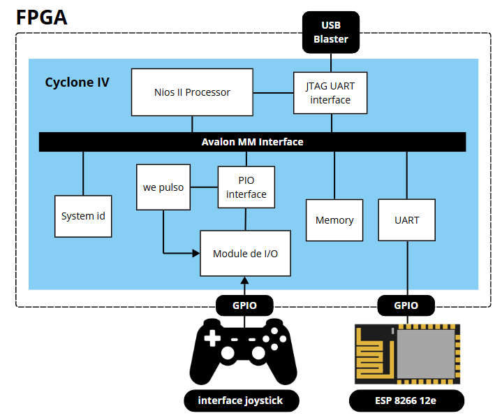

  

<h1 align="center">TeleCore64 Console
</h1>

<h3 align="center"> Projeto de Desenvolvimento de uma Interface Portátil para Teleoperação de Robô em Ambiente de 
Realidade Aumentada Usando FPGA
</h3>

 
<h2>Descrição do Projeto</h2>

Este repositório documenta um projeto de iniciação científica, patrocinado pelo **CNPq**, que tem como objetivo desenvolver uma interface portátil de videogame para jogos 2D (console) e controlar um robô utilizando uma **FPGA**. O projeto explora a integração de sistemas embarcados, comunicação serial e protocolos de rede, promovendo uma interação inovadora entre jogos e robótica.  

O projeto é dividido em três etapas principais:  

### 1. Desenvolvimento do Console de Videogame  
- Utilização do processador **Nios II** e de um processador gráfico **CoLenda**.  
- Desenvolvimento da interface de controle do console.  
- Criação da interface de vídeo utilizando **HDMI**.  

### 2. Comunicação entre a FPGA e o Robô  
- Implementação de um **ESP** como intermediário para conectar a FPGA ao robô.  
- Utilização de **UART** para a comunicação entre a FPGA e o ESP.  
- Uso do protocolo **TCP/IP** para a comunicação do ESP com o **ROS (Robot Operating System)**.  

### 3. Integração do Console com o Robô  
- O console envia comandos para o robô enquanto o jogo é jogado.  
- Sincronização entre os dados do jogo e as ações do robô. 

<h1 align="center"> Sumário </h1>

	<ul>
        <li><a href="#arqFPGA"> Arquitetura do hardware</a></li>
        <li><a href="#descrip"> Visão Geral </a></li>
        <li><a href="#pinout"> Pinout </a></li>
        <li><a href="#referencias"> Referências </a></li>
	</ul>	

<h2>Arquitetura do hardware</h2>

A figura a seguir mostra a versão simplificada da arquitetura total do sistema já desevolvida:

  

<strong> Figura X: Arquitetura total do projeto</strong>

 

 

<h2>Pinout</h2>

| Num Pin | GPIO     |FPGA PIN | Função no Controle |
|---------|----------|---------|--------------------|
| 9       | GPIO_16  | PIN_R12 | HSYNC              |
| 10      | GPIO_17  | PIN_T11 | VSYNC              |
| 14      | GPIO_19  | PIN_R11 | B[2]               |
| 16      | GPIO_111 | PIN_R10 | B[1]               |
| 18      | GPIO_113 | PIN_P9  | B[0]               |
| 20      | GPIO_115 | PIN_N11 | G[2]               |
| 22      | GPIO_117 | PIN_K16 | G[1]               |
| 24      | GPIO_119 | PIN_L15 | G[0]               |
| 26      | GPIO_121 | PIN_P16 | R[2]               |
| 28      | GPIO_123 | PIN_N16 | R[1]               |
| 27      | GPIO_122 | PIN_R14 | R[0]               |

<strong> Tabela com a pinagem do VGA</strong>

| PIN | Name PIN | FPGA PIN | Função             |
|-----|----------|----------|--------------------|
| 39  | GPIO_032 | PIN_D12  | Botão Y            |
| 37  | GPIO_030 | PIN_A12  | Botão START        |
| 35  | GPIO_028 | PIN_C11  | Botão A            |
| 33  | GPIO_026 | PIN_E11  | Direcional RIGHT   |
| 31  | GPIO_024 | PIN_C9   | Direcional LEFT    |
| 40  | GPIO_033 | PIN_B12  | Direcional DOWN    |
| 38  | GPIO_031 | PIN_D11  | Direcional UP      |
| 36  | GPIO_029 | PIN_B11  | Botão B            |
| 34  | GPIO_027 | PIN_E10  | Botão TR           |
| 32  | GPIO_025 | PIN_D9   | Botão SELECT       |
| 28  | GPIO_023 | PIN_E9   | Botão TL           |
| 26  | GPIO_021 | PIN_F8   | Botão X            |
| -   | CLOCK_50 | PIN_R8   | CLOCK principal    |
| -   | KEY1     | PIN_E1   | Botão de reset     |

<strong> Tabela 10: Pinagem dos botões e analogico</strong>

 

 

<h2>Referências</h2>

> Embedfire. **Design e verificação do driver de vídeo HDMI**. <https://doc.embedfire.com/fpga/altera/ep4ce10_pro/zh/latest/code/hdmi.html>.
>
> Ti. **PMP10580 DE0-Nano User Manual (Terasic/Altera)**. <https://www.ti.com/lit/ug/tidu737/tidu737.pdf>.
>

