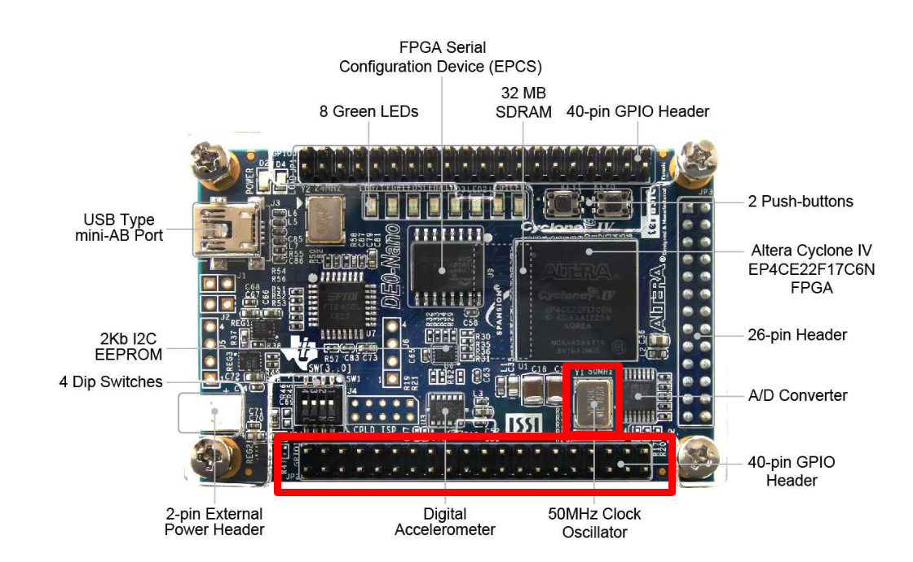
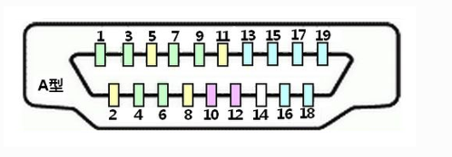
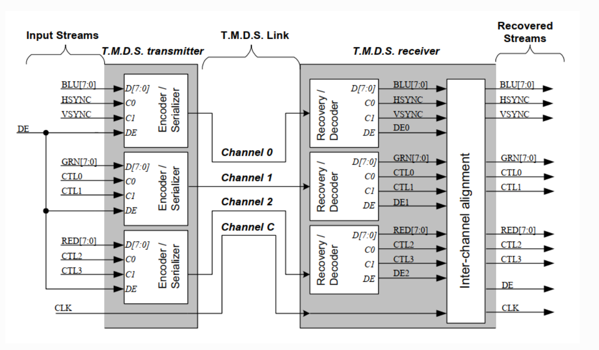

  

<h1 align="center">Game Kart
</h1>

<h3 align="center"> Projeto de Desenvolvimento de uma Interface Portátil para Teleoperação de Robô em Ambiente de 
Realidade Aumentada Usando FPGA
</h3>

<h1 align="center"> Sumário </h1>

	<ul>
        <li><a href="#controle"> FPGA De0-Nano </a></li>
        <li><a href="#controle"> Interface Portátil </a></li>
        <li><a href="#hdmi"> High-Definition Multimedia Interface (HDMI) </a></li>
        <li><a href="#referencias"> Referências </a></li>
	</ul>	

 

 

<h2>FPGA De0-Nano</h2>

Modelo Altera Cyclone IV **EP4CE22F17C6N** FPGA;

<h3>Pinagem</h3>

  

<strong>Elementos Utilizados na Pinagem do FPGA</strong>

| PIN | Name PIN | FPGA PIN | Função no Controle |
|-----|----------|----------|--------------------|
| 2   | GPIO_10  | PIN_F13  | START              |
| 4   | GPIO_11  | PIN_T15  | Y                  |
| 6   | GPIO_13  | PIN_T13  | X                  |
| 8   | GPIO_15  | PIN_T12  | B                  |
| 10  | GPIO_17  | PIN_T11  | TR                 |
| 12  | GND      | -        | -                  |
| 14  | GPIO_19  | PIN_R11  | TL                 |
| 16  | GPIO_111 | PIN_R10  | A                  |
| 18  | GPIO_113 | PIN_P9   | RIGHT              |
| 20  | GPIO_115 | PIN_N11  | LEFT               |
| 22  | GPIO_117 | PIN_K16  | DOWN               |
| 24  | GPIO_119 | PIN_L15  | UP                 |
| 26  | GPIO_121 | PIN_P16  | SELECT             |
| 28  | GPIO_123 | PIN_N16  | START              |
| 30  | GND      |          | -                  |
| -   | CLOCK_50 | PIN_R8   | -                  |

<strong> Tabela com a pinagem do FPGA De0-Nano</strong>

 

 

<h2>Inteface Portátil
</h2>

<h3>Pinagem
</h3>

| PIN  | Definição | | PIN | Definição |
|------|-----------|-|-----|-----------|
| 1  	 | 3.3 V     | | 2   | 5 V       |
| 7    | SELECT V  | | 4   | 5 V       |
| 9    | GND       | | 6   | GND       |
| 17   | 3.3 V     | | 12  | TL        |
| 25   | GND       | | 14  | GND       |
| 29   | UP        | | 16  | TR        |
| 31   | DOWN      | | 20  | GND       |
| 33   | LEFT      | | 30  | GND       |
| 35   | RIGHT     | | 32  | B         |
| 37   | A         | | 34  | GND       |
| 39   | GND       | | 36  | X         |
| -    | -         | | 38  | Y         |
| -    | -         | | 40  | START     |

<strong> Tabela com a pinagem do controle</strong>

 

 
<h2>High-Definition Multimedia Interface (HDMI)</h2>

<h3> Pinagem </h3>

  

<strong>Organização dos pinos do HDMI</strong>

| PIN   | Definição                        | | PIN | Definição                                  |
|-------|----------------------------------|-|-----|--------------------------------------------|
| 1  	  | Dados2+ (TMDS Dados2+)           | | 11  | Escudo do Relógio (Escudo do Relógio TMDS) |
| 2  	  | Escudo TMDS Data2                | | 12  | Relógio- (Relógio TMDS–)                   |
| 3  	  | Dados2- (Dados TMDS2-)           | | 13  | CEC                                        |
| 4  	  | Dados1+ (Dados TMDS1+)           | | 14  | reserva                                    |
| 5  	  | Escudo TMDS Data1                | | 15  | Linha de relógio DDC (SCL)                 |
| 6  	  | Dados1- (Dados TMDS1-)           | | 16  | Linha de dados DDC (SDA)                   |
| 7  	  | Dados0+ (Dados TMDS0+)           | | 17  | DDC/CEC GND                                |
| 8  	  | Escudo Data0 (Escudo Data0 TMDS) | | 18  | Fonte de alimentação +5V (alimentação)     |
| 9  	  | Dados0- (Dados TMDS0-)           | | 19  | Detecção de hot plug                       |
| 10  	 | Relógio+ (Relógio TMDS+)         | | -   | -                                          |

<strong> Tabela com a pinagem do HDMI </strong>

<h3> Transition Minimized Differential signal (TMDS) </h3>

O sistema de transmissão TMDS em HDMI é dividido em duas partes: a extremidade de envio e a extremidade de recepção. O 
transmissor TMDS recebe dados paralelos de 24 bits representando o sinal RGB da interface HDMI (TMDS codifica as três 
cores primárias RGB de cada pixel em 8 bits, ou seja, o sinal R possui 8 bits, o sinal G possui 8 bits e o sinal B tem
8 bits), então codifica e converte esses dados e sinais de clock em paralelo/serial e, em seguida, distribui os dados e 
sinais de clock que representam os três sinais RGB para canais de transmissão independentes e os envia. A extremidade 
receptora recebe o sinal serial da extremidade transmissora, decodifica-o e converte-o em serial/paralelo e, em seguida,
envia-o para a extremidade de controle do display. Simultaneamente, o sinal do relógio também é recebido para obter 
a sincronização.

  

<strong>Diagrama de funcionamento do TMDS</strong>

 

 
<h2>Referências</h2>

> Embedfire. **Design e verificação do driver de vídeo HDMI**. <https://doc.embedfire.com/fpga/altera/ep4ce10_pro/zh/latest/code/hdmi.html>.
>
> Ti. **PMP10580 DE0-Nano User Manual (Terasic/Altera)**. <https://www.ti.com/lit/ug/tidu737/tidu737.pdf>.
>

