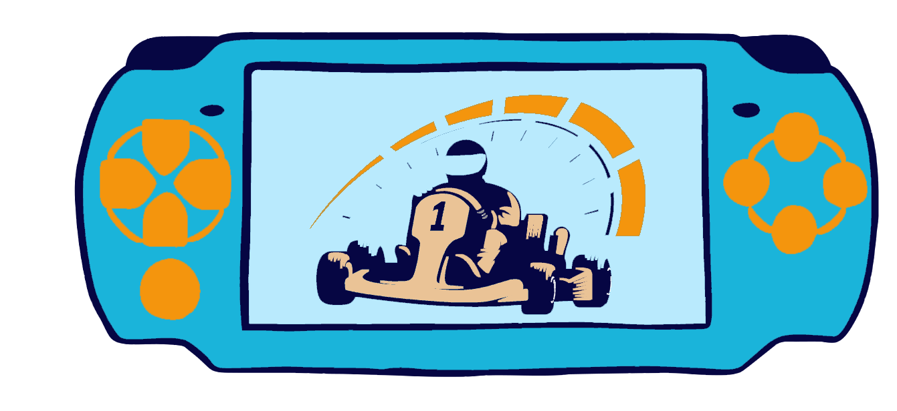

  

<h1 align="center">Game Kart</h1>
<h3 align="center"> Projeto de Desenvolvimento de uma Interface Portátil para Teleoperação de Robô em Ambiente de 
Realidade Aumentada Usando FPGA
</h3>

 

 
<h2>Inteface Portátil</h2>

<h3>Pinagem</h3>

| PIN  | Identificação | | PIN | Identificação |
|------|---------------|-|-----|---------------|
| 1  	 | 3.3 V         | | 2   | 5 V           |
| 7    | SELECT V      | | 4   | 5 V           |
| 9    | GND           | | 6   | GND           |
| 17   | 3.3 V         | | 12  | TL            |
| 25   | GND           | | 14  | GND           |
| 29   | UP            | | 16  | TR            |
| 31   | DOWN          | | 20  | GND           |
| 33   | LEFT          | | 30  | GND           |
| 35   | RIGHT         | | 32  | B             |
| 37   | A             | | 34  | GND           |
| 39   | GND           | | 36  | X             |
| -    | -             | | 38  | Y             |
| -    | -             | | 40  | START         |

<strong> Tabela com a pinagem do controle </strong>

 

 
<h2>High-Definition Multimedia Interface (HDMI)</h2>

 

 
<h2>Referências</h2>

> Embedfire. **Design e verificação do driver de vídeo HDMI**. <https://doc.embedfire.com/fpga/altera/ep4ce10_pro/zh/latest/code/hdmi.html>
>
> 

