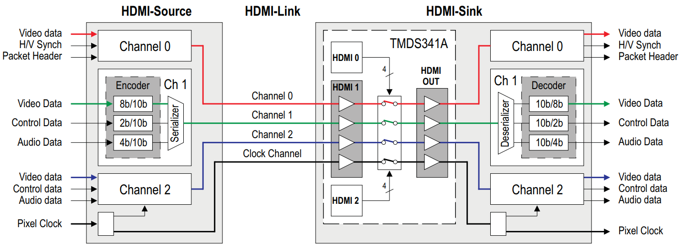
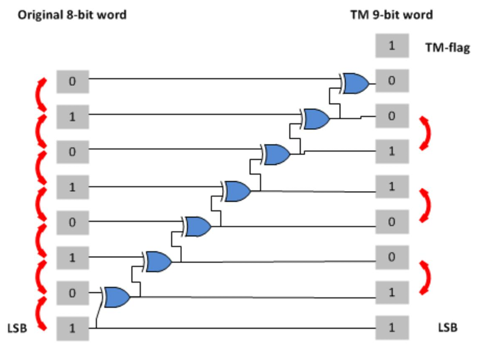
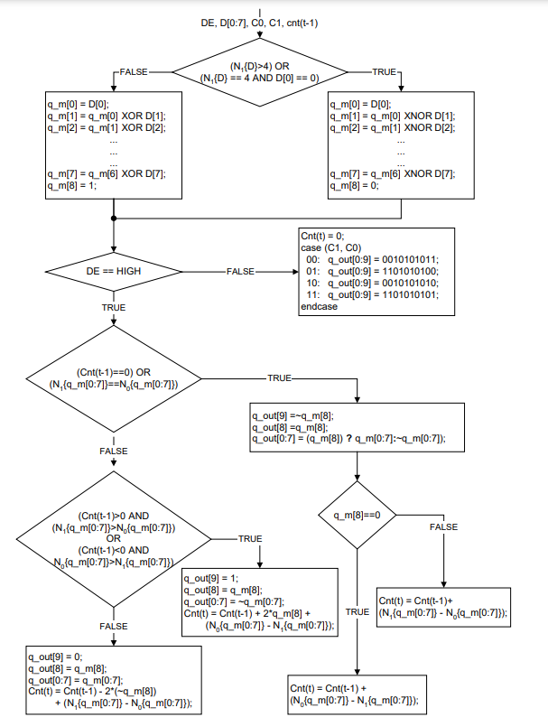
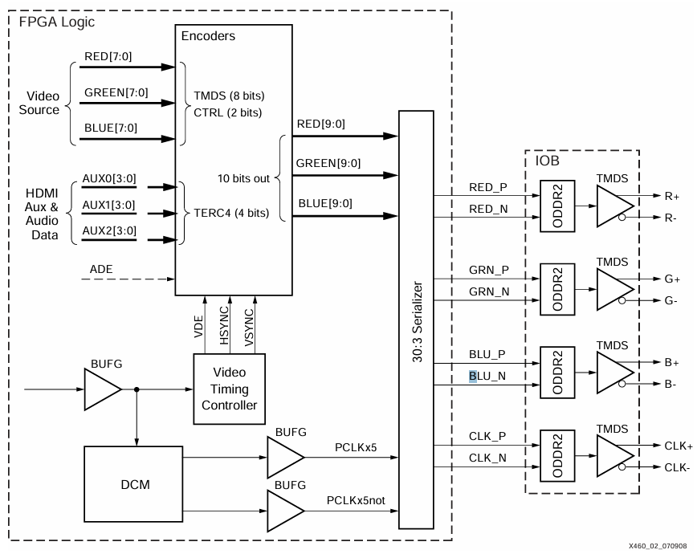
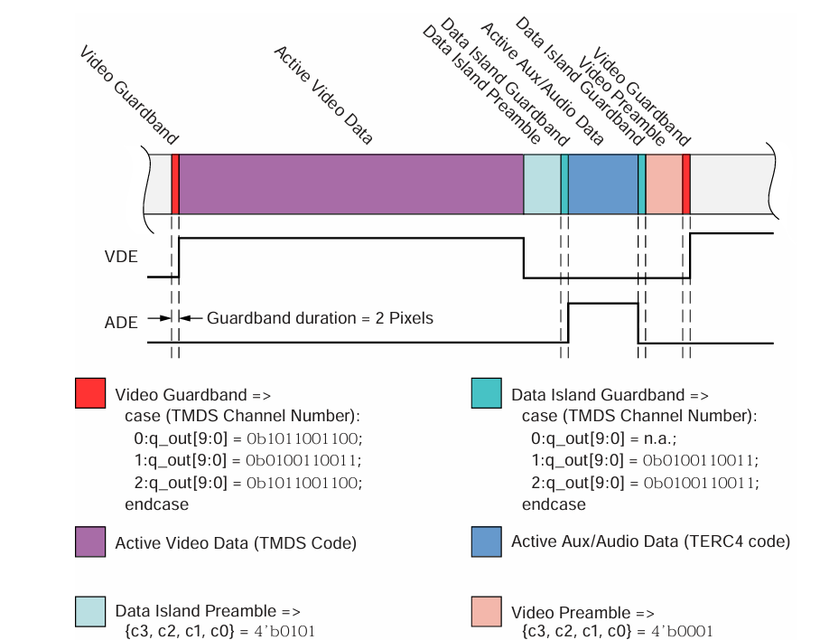
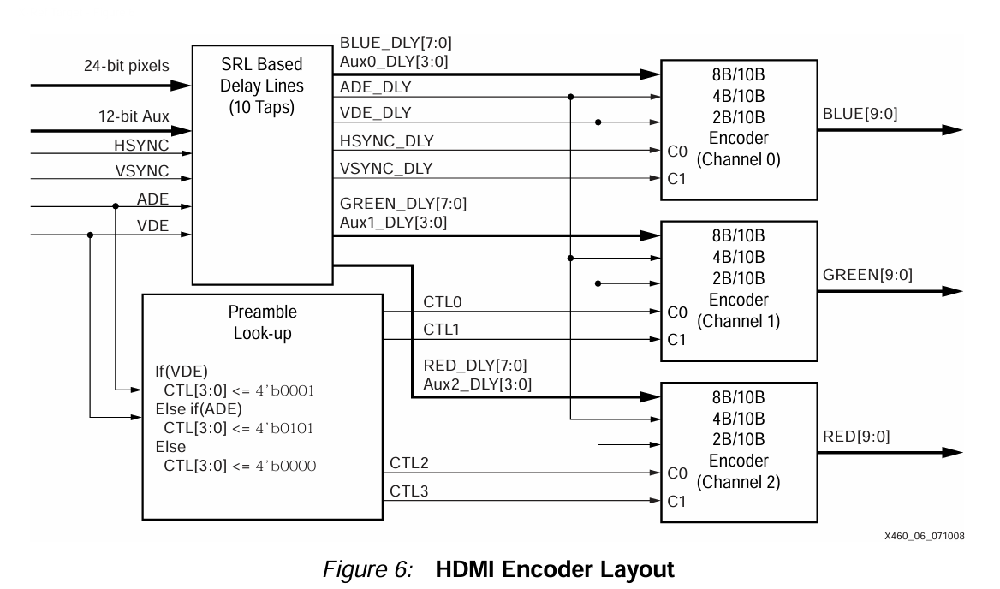

  

<h1 align="center">Modulo de vídeo HDMI
</h1>

<h3 align="center">
Deselvolvimento de um módulo de vídeo HDMI para FPGA
</h3>

<h2>TMDS</h2>

No  transmissor,  há  três  codificadores  idênticos,  onde  cada  um  está  acionando  um  canal  de  dados  TMDS  serial.  Um  cabo  HDMI  carrega  quatro  pares  diferenciais  que  compõem  os  canais  de  dados  e  clock  TMDS.  Os  canais  de dados  carregam  dados  auxiliares,  além  de  áudio  e  vídeo.

  

 Figura X: Versão simplificada do TMDS 

<h3> Clock TMDS </h3>

A  frequência  do  relógio  TMDS  é  tipicamente  relacionada  à  taxa  de  pixel  do  vídeo  e  é  usada  pelo  receptor  para  sincronizar  a  recuperação  de  dados.  O  transmissor  opera  em  duas  frequências  de  relógio  diferentes,  onde  a  mais lenta  é  a  frequência  do  relógio  TMDS.  A  serialização  é  feita  em  uma  frequência  que  é  dez  vezes  maior  que  a frequência  do  relógio  TMDS.  O  sinal  do  relógio  é  transmitido  no  canal  do  relógio  TMDS.

<h3> Modos TMDS </h3>

O  HDMI  tem  três  modos  de  operação  TMDS  diferentes:

- Video Data Period:  Pixels  ativos  de  uma  linha  de  vídeo  ativa  são  transmitidos;

- Data Island Period:   Uma  série  de  pacotes  contendo  dados  de  áudio  e  auxiliares  é transmitido;

- Control Period:  Usado  quando  nenhum  vídeo,  áudio  ou  dados  auxiliares  precisam  ser  transmitidos.

<h3>Algoritmo TMDS</h3>

A  sinalização  diferencial  minimizada  por  transição  é  uma  tecnologia  de  transmissão  de  dados  seriais  de  alta velocidade. Um  algoritmo  de  codificação  avançado é  incorporado  no  transmissor  para  reduzir a interferência  eletromagnética  em  cabos  de  cobre  e  para  executar  o  balanceamento  CC  da  transmissão  de  dados  em  cabos  de  fibra  óptica.  Também  torna  possível  atingir  alta  tolerância  de  distorção  devido  a  uma  recuperação de  clock  mais  robusta  no  receptor.  O  algoritmo  transforma  uma  palavra  de  8  bits  em  uma  palavra  codificada TMDS  de  10  bits  em  dois  estágios.

Primeiro estágio de codificação: produzir uma palavra de 9 bits, consistindo de uma nova representação dos  8 bits de entrada e um bit de sinalização. Os 8 bits de entrada combina o bit menos significativo LSB da saída com a entrada. Os sete bits restantes da saida são derivador xnor, onde cada bit da entrada é consequentemente XNOR com o bit derivado anterior (e o LSB).

  

 Figura X: Primeiro estágio de codificação 

Algoritmo de codificação TMDS: O segundo estágio de codificação é a conversão da palavra de 9 bits em uma palavra de 10 bits. O balanceamento DC é feito invertendo seletivamente a representação de dados de 9 bits do estágio de Minimização de Transição. Isso é baseado na disparidade em execução entre uns e zeros. Se muitos zeros foram transmitidos e a representação contém mais zeros do que uns, a palavra de código é invertida. Um décimo bit é adicionado e declara se a palavra de código foi invertida ou não.

  

 Figura X: Algoritmo de codificação TMDS 

<h3>Sinalização  Diferencial</h3>

A  sinalização  diferencial  é  um  método  de  transmissão  de  informações  eletricamente  com  dois  sinais  complementares  enviados  em  dois  fios  pareados,  chamados  de  par  diferencial.  A  interferência  externa   tende  a  afetar  ambos  os  fios  igualmente,  e  um  sinal  é,  portanto,  enviado  como  o  inverso  do  outro.  A  técnica melhora  a  resistência  ao  ruído  eletromagnético  em  comparação  com  o  uso  de  fio  único  e  terra  como  uma referência  não  pareada 

<h3>Design do Transmissor</h3>

  

 Figura X: Design do Transmissor 

<h3>HDMI Encoder</h3>

  

 Figura X: Esquema de codificação 

  

 Figura X: Layout do codificador 

