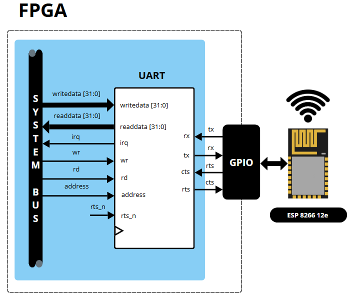

  

<h1 align="center">Modulo de Network
</h1>

<h3 align="center">
Desenvolvimento de um Módulo de Comunicação em Rede entre FPGA e ESP8266 12E utilizando UART
<h3>

 
<h2>Descrição do Projeto</h2>

<h2> Autor  </h2>
<uL>
  <li><a href="https://github.com/TAlmeida003">Thiago Neri dos Santos Almeida</a></li>
  <li>Engenharia de Computação — UEFS</li>
</ul>

<h2> Orientador  </h2>
<ul>
      <li>Dr. Anfranserai Morais Dias</li>
      <li>Departamento de Tecnologia (DTEC) — UEFS</li>
</ul>

<h1 align="center"> Sumário </h1>

  <ul>
      <li><a href="#uart"> UART </a></li>
        <ul>
          <li><a href="#baud"> Baud Rate </a></li>
          <li><a href="#conexao"> Sinais de Conexão </a></li>
          <li><a href="#flow control"> Controle de Fluxo </a></li>
          <li><a href="#rx"> Receptor UART </a></li>
          <li><a href="#tx"> Transmissor UART </a></li>
        </ul>
      <li><a href="#fifo"> FIFO </a></li>
      <li><a href="#esp"> ESP8266 12e </a></li>
        <ul>
          <li><a href="#comand"> Comandos de Controle </a></li>
        </ul>
      <li><a href="#arq"> Arquitetura do Projeto </a></li>
        <ul>
          <li><a href="#arqUARTt"> Modulo UART </a></li>
          <li><a href="#comunPross"> Comunicação entre o processador e o ESP8266 12e </a></li>
          <li><a href="#reg"> Organização dos Registradores </a></li>
        </ul>
      <li><a href="#referencias"> Referências </a></li>
  </ul>	

<h2>UART</h2>

Um receptor e transmissor assíncrono universal (em inglês, *Universal Asynchronous Receiver and Transmitter*), com a sigla **UART**, 
é um circuito utilizado para enviar dados paralelos por meio de uma linha serial, onde os bits são transmitidos sequencialmente, um de cada vez, formando uma fila [PEDRONI, 2008]. Essa comunicação é considerada **assíncrona**, pois não exige o sincronismo entre os relógios do receptor e do transmissor. Cada caractere transmitido carrega seus próprios sinais de sincronismo [EPUSP, 2015].

A comunicação UART é **full-duplex**, ou seja, permite a transmissão e recepção de dados simultaneamente. Os dados são enviados do bit **LSB** (Least Significant Bit) para o **MSB** (Most Significant Bit). A linha serial é **1** quando está ociosa. A transmissão começa com um **bit de início**, que é **0**, seguido pelos **bits de dados** e, opcionalmente, um **bit de paridade**. A transmissão termina com **bits de parada**, que são sempre **1** [PEDRONI, 2008]. 

As configurações comuns incluem:
- **Número de bits de dados**: 6, 7 ou 8 bits.
- **Número de bits de parada**: 1, 1,5 ou 2 bits.
- **Paridade**: Opcional.

A configuração padrão utilizada é de **8 bits de dados**, sem paridade, e **1 bit de parada**.

Abaixo, é apresentada uma figura que ilustra a estrutura de um quadro de dados UART.

  

<strong> Figura X: Estrutura de um quadro de dados UART</strong>

  <h3>Baud Rate</h3>

  
Para a comunicação entre a FPGA e o ESP8266 12e, ambos os dispositivos precisam usar a mesma taxa de transmissão de dados, chamada Baud Rate. Essa taxa, medida em bits por segundo (bps), pode ter valores como 9.600 bps, 115.200 bps, 921.600 bps, entre outros.

  
No projeto, foi utilizada a taxa de 115.200 bps, que é o padrão do ESP8266. Para garantir a correta amostragem dos dados, foi aplicado um procedimento de <strong>sobreamostragem</strong>, que consiste em amostrar o sinal de entrada a uma frequência 16 vezes maior que a taxa de transmissão. Isso assegura que o sinal seja capturado no momento correto, reduzindo erros.

  
Para configurar a taxa na FPGA, calcula-se o divisor de frequência do clock do módulo UART com a fórmula:

  

    
  

  
Onde:

  

    
  

  
Essa configuração gera uma margem de erro de apenas <strong>0,47%</strong>, que é aceitável para a comunicação serial.

<h3>Controle de Fluxo</h3>

O controle de fluxo é usado para garantir que os dados sejam transmitidos sem perda de informações. Ele permite que o receptor avise o transmissor quando está pronto para receber dados. Existem dois métodos principais: <strong>XON/XOFF</strong> e <strong>RTS/CTS</strong>. Este projeto utiliza o método RTS/CTS devido à sua eficiência e para evitar sobrecarga de dados (overhead).

No método <strong>RTS/CTS</strong>, o transmissor ativa (nível lógico LOW) o sinal <strong>RTS</strong> quando está pronto para enviar dados, indicando que seu buffer de transmissão está vazio. O receptor ativa (nível lógico LOW) o sinal <strong>CTS</strong> quando está pronto para receber dados, indicando que seu buffer de recepção está vazio. 

Para garantir que nada seja perdido por overflow, o sinal é assionado quando o buffer está 75% cheio. Isso permite que mesmo que o transmissor envie dados a maior que a taxa de recepção, o receptor ainda possa receber os dados sem perda de informações.

O sinal RTS do transmissor é conectado ao pino CTS do receptor, e o sinal CTS do receptor é conectado ao pino RTS do transmissor. Isso permite que o transmissor e o receptor se comuniquem entre si, garantindo que os dados sejam transmitidos corretamente.

Abaixo, são apresentados os diagramas temporais dos sinais RTS e CTS:

  

<strong> Figura X: Diagrama temporal dos sinais CTS</strong>

  

<strong> Figura X: Diagrama de temporal dos sinais RTS</strong>

<h3>Sinais de Conexão</h3>

Na comunicação UART, é utilizada a norma EIA-RS-232C como referência para a conexão entre dispositivos, garantindo que fabricantes diferentes possam seguir uma interface comum [EPUSP, 2015]. Os sinais utilizados no projeto são descritos a seguir:

<ul>
  <li><strong>Transmissão de Dados (TXD - Transmit Data):</strong> Transmite dados da FPGA para o ESP8266 12e.</li>
  <li><strong>Recepção de Dados (RXD - Receive Data):</strong> Recebe dados do ESP8266 12e para a FPGA.</li>
  <li><strong>Pronto para Enviar (RTS - Ready to Send):</strong> Indica que a FPGA está pronta para enviar dados.</li>
  <li><strong>Pronto para Receber (CTS - Clear to Send):</strong> Indica que o ESP8266 12e está pronto para receber dados.</li>
  <li><strong>Terra (GND - Ground):</strong> Referência de tensão.</li>
</ul>

A norma EIA-RS-232C também define outros sinais, como DTR, DSR, DCD e RI, que não são utilizados neste projeto. Além disso, embora a norma especifique níveis de tensão próprios para RS-232, o projeto utiliza sinais em níveis lógicos de 0V para o nível lógico 0 e 3,3V para o nível lógico 1, adequados aos dispositivos conectados.

A figura a seguir ilustra a conexão entre a FPGA e o ESP8266 12e usando o padrão UART, mostrando os sinais de conexão utilizados.

  

<strong> Figura X: Conecção entre FPGA e ESP8266 12e usando UART</strong>

<h3>Receptor UART</h3>

O receptor UART é responsável por receber os dados transmitidos pelo transmissor e enviá-los para a FPGA. É usado uma máquina de estados para controlar a recepção dos dados. A máquina de estados é composta por quatro estados: **IDLE**, **START**, **DATA**, **STOP** e **ERROR**.

Estado **IDLE**: O receptor aguarda a detecção do bit de início, que é o bit 0. Quando o bit de início é detectado, o receptor muda para o estado **START** e então inicie
o contador de tiques de amostragem.

Estado **START**: O receptor aguarda o meio do bit de início para sincronizar a amostragem dos dados. Quando o meio do bit de início é detectado, o receptor muda para o estado **DATA** e inicia a amostragem dos bits de dados. Em caso de uma falha na detecção do bit de início, o receptor vai para o estado de **ERROR**.

Estado **DATA**: Quando o contador atinge 15, o sinal de entrada progride por um bit e atinge
o meio do primeiro bit de dados. Recupere seu valor, desloque-o para um registrador e reinicie
o contador. O receptor permanece neste estado até que todos os bits de dados sejam recebidos. Quando o último bit de dados é recebido, o receptor muda para o estado **STOP**.

Estado **STOP**: O receptor aguarda o meio do bit de parada. Quando o meio do bit de parada é detectado, o receptor muda para o estado **IDLE** e envia os dados recebidos para a FPGA junto com o sinal confirmado o recebimento dos dados. Em caso de uma falha na detecção do bit de parada, o receptor vai para o estado de **ERROR**.

Estado **ERROR**: O receptor fica nesse até que o que o sinal de entrada volte a ser 1, indicando que o sinal estabilizou. Quando o sinal estabiliza, o receptor volta para o estado **IDLE**.

  

<strong> Figura X: Máquina de estados do receptor UART</strong>

  <h3>Transmissor UART</h3>

  

    O transmissor UART é responsável por enviar os dados recebidos pela FPGA para o ESP8266 12e. A organização de um subsistema de transmissão UART é semelhante à do subsistema de recepção, com a principal diferença sendo os sinais de controle e a lógica de transmissão.
  

  

    A taxa de transmissão é controlada por tiques gerados a partir de um ciclo de clock, que são produzidos por um gerador de taxa de transmissão. Como não há sobreamostragem no transmissor, a frequência dos tiques é 16 vezes mais lenta do que a do receptor UART. Para controlar o número de tiques, o transmissor geralmente compartilha o gerador de taxa do receptor e utiliza um contador interno. A cada 16 tiques de habilitação, um bit é deslocado e enviado.
  

 
  O transmissor UART é composto por uma máquina de estados que controla a transmissão dos dados. A máquina de estados é composta por quatro estados: **IDLE**, **START**, **DATA** e **STOP**.

  Estado **IDLE**: O transmissor aguarda a solicitação de transmissão de dados. Quando a solicitação é recebida, o transmissor muda para o estado **START** e inicia o contador de tiques de transmissão.

  Estado **START**: O transmissor aguarda os 16 tiques de transmissão para sincronizar a transmissão dos dados. Quando os 16 tiques são contados, o transmissor muda para o estado **DATA** e inicia a transmissão dos bits de dados.

  Estado **DATA**: Quando o contador atinge 15, o sinal de saída progride por um bit deslando o valor de entrada até que todos os bits de dados sejam transmitidos. Quando o último bit de dados é transmitido, o transmissor muda para o estado **STOP**.

  Estado **STOP**: O transmissor aguarda os 16 tiques de transmissão para sincronizar a transmissão do bit de parada. Quando os 16 tiques são contados, o transmissor muda para o estado **IDLE**.
  

  

    A figura a seguir ilustra a máquina de estados do transmissor UART.
  

  

    
  

  

    <strong> Figura X: Máquina de estados do transmissor UART</strong>
  

<h2>FIFO</h2>

Para armazenar dados recebidos e transmitidos em sistemas digitais, é amplamente utilizado um buffer FIFO (First In, First Out). Essa estrutura de dados segue o princípio "o primeiro que entra é o primeiro que sai", garantindo que os dados sejam lidos na mesma ordem em que foram escritos, o que é essencial para manter a integridade e a sequência de informações em diversas aplicações.

  

<strong> Figura X: Estrutura 
de um buffer FIFO</strong>

O funcionamento do FIFO é baseado em dois ponteiros: o ponteiro de escrita e o ponteiro de leitura. O ponteiro de escrita aponta para a posição onde o próximo dado será armazenado, enquanto o ponteiro de leitura aponta para a posição do próximo dado a ser lido. Quando o buffer está vazio, ambos os ponteiros apontam para a mesma posição, indicando que não há dados disponíveis para leitura. Quando o buffer está cheio, o ponteiro de escrita atinge a posição imediatamente anterior ao ponteiro de leitura, impedindo novas operações de escrita até que algum dado seja lido.

Essa estrutura é projetada para operar de forma eficiente em sistemas com múltiplos processos ou dispositivos que compartilham dados. Além disso, o FIFO pode incorporar sinalizadores auxiliares, como "quase cheio" (almost full) e "quase vazio" (almost empty), que ajudam no gerenciamento do buffer, prevenindo sobrecargas e melhorando o desempenho do sistema. A figura a seguir ilustra a estrutura de um buffer FIFO:

  

<strong> Figura X: Exemplo das fases de um buffer FIFO</strong>

Os buffers FIFOs foram utilizados no projeto para armazenar os dados recebidos e transmitidos pela FPGA, garantindo a integridade e a ordem dos dados durante a comunicação com o ESP8266 12e. 

 

 
<h2>ESP8266 12e</h2>

<h3> Comandos de Controle</h3>

O ESP8266 12e se comunica com a FPGA através de comandos AT, que são comandos de controle que permitem a configuração do módulo. Os comandos AT são enviados pela FPGA para o ESP através da comunicação UART. Por default, o ESP opera a uma taxa de 115200 bps.

Comandos basicos:

 

|comando             |descrição| resposta|
|--------------------|---------|---------|
|AT|Teste de comunicação|OK|
|ATE0|Desabilita o eco de caracteres.|OK|
|AT+RST|Reinicia o módulo.|OK|
|AT+GSLP=\<time>|Coloca o módulo em modo de baixo consumo de energia por um tempo especificado.|\<time> OK|
AT+RESTORE|Restaura as configurações de fábrica.|OK|
|AT+UART_CUR=\<baud>,\<databits>,\<stopbits>,\<parity>,\<flow control>|Configura a UART.|OK|
|AT+UART_DEF=\<baud>,\<databits>,\<stopbits>,\<parity>,\<flow control>|Configura a UART de forma permanente.|OK|

<strong> Tabela X: Comandos básicos do ESP8266 12e</strong>

>  O comando AT+UART_CUR=115200,8,1,0,3 configura a UART para 115200 bps, 8 bits de dados, 1 bit de parada, sem paridade e com controle de fluxo RTS/CTS.

Comandos wifi:

 

|comando|descrição| resposta|
|-------------------|---------|---------|
|AT+CWMODE=\<mode>|Configura o modo de operação do módulo.|OK|
|AT+CWJAP=\<ssid>,\<password>|Conecta o módulo a uma rede Wi-Fi.|OK ou ERRO|
|AT+CWLAP|Lista as redes Wi-Fi disponíveis.|OK|
|AT+CWQAP|Desconecta o módulo da rede Wi-Fi.|OK|
|AT+CWAUTOCONN=\<enable>|Habilita/desabilita a conexão automática à rede Wi-Fi.|OK|

<strong> Tabela X: Comandos de configuração Wi-Fi do ESP8266 12e</strong>

> O comando AT+CWMODE=3 configura o módulo para operar em modo AP e STA.

> O comando AT+CWJAP="ssid","password" conecta o módulo a uma rede Wi-Fi com SSID e senha especificados.

Comandos TCP/IP:

 

|comando|descrição| resposta|
|-------------------|---------|---------|
|AT+CIPSTATUS| Retorna o status da conexão TCP/IP.|STATUS:\<status>|
|AT+CIPSTART=\<type>,\<addr>,\<port>|Estabelece uma conexão TCP/IP.|CONNECT ou ERRO|
|AT+CIPSSLSIZE=\<size>|Configura o tamanho do buffer SSL.|OK|
|AT+CIPSEND=\<length>|Envia dados pela conexão TCP/IP.|OK ou ERRO|
|AT+CIPCLOSE|Fecha a conexão TCP/IP.|CLOSED|
|+IPD|Recebe dados pela conexão TCP/IP.|+IPD,\<length>:\<data>|
|AT+CIPRECVMODE=\<mode>|Configura o modo de recepção de dados.|OK|
|AT+CIPRECVDATA=\<length>|Recebe dados no modo manual.|OK|

<strong> Tabela X: Comandos de configuração TCP/IP do ESP8266 12e</strong>

> Ao usar AT+CIPSEND espera-se que o módulo responda com o caractere >, indicando que o módulo está pronto para receber os dados a serem enviados.

> O comando AT+CIPRECVMODE=0 configura o módulo para receber dados de forma automática e AT+CIPRECVMODE = 1 configura o módulo para receber dados manualmente.

 

<h2>Arquitetura do Projeto</h2>

<h3>Modulo UART</h3>

Versão simplificada da arquitetura do módulo UART:

  

<strong> Figura X: Versão simplificada da arquitetura do módulo UART</strong>

<h3>Comunicação entre o processador e o ESP8266 12e</h3>

Segue a versão simplificada da comunicação entre o processador e o ESP8266 12e utilizando a UART:

  

<strong> Figura X: Versão simplificada da comunicação entre o processador e o ESP8266 12e</strong>

<h3>Organização dos Registradores</h3>

 

 
<h2>Referências</h2>

> PEDRONI, Volnei A. FPGA Prototyping by Verilog Examples: Xilinx Spartan-3 Version. 1st ed. Hoboken: Wiley-Interscience, 2008.

> EPUSP — PCS 2021 — Laboratório Digital. **UART**. Versão 2015. Disponível em: <a href="https://www2.pcs.usp.br/~labdig/pdffiles_2015/uart.pdf" target="_blank">https://www2.pcs.usp.br/~labdig/pdffiles_2015/uart.pdf</a>. Acesso em 19 de Dezembro de 2024.

> Espressif. **ESP8266 AT Instruction Set**. Disponível em:
<https://www.espressif.com/sites/default/files/documentation/4a-esp8266_at_instruction_set_en.pdf>.
Acesso em: 16 de Dezembro de 2024.

