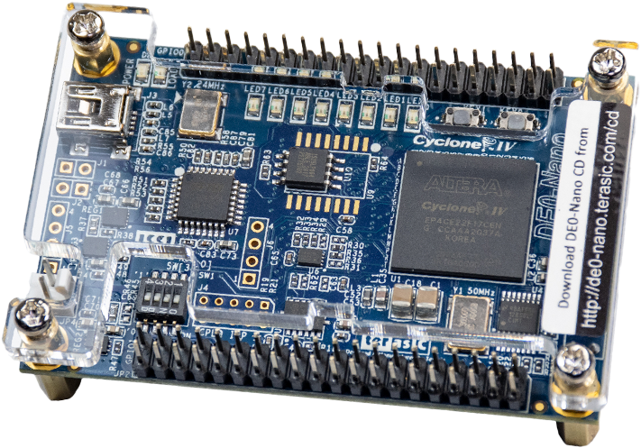
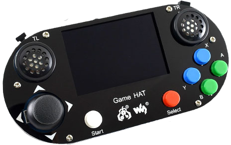
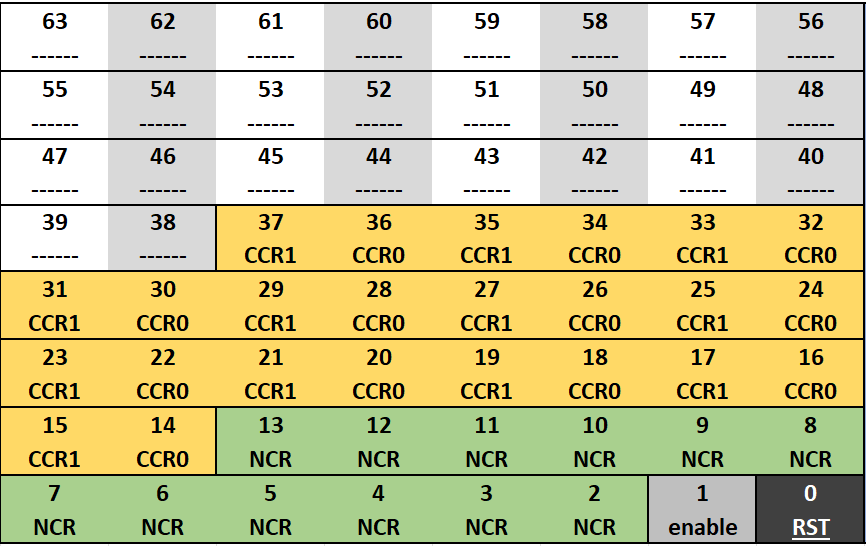
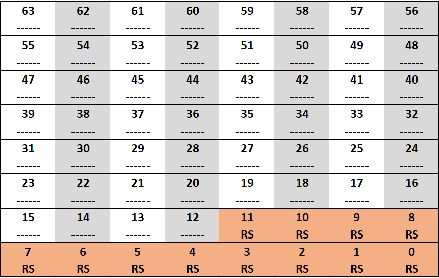
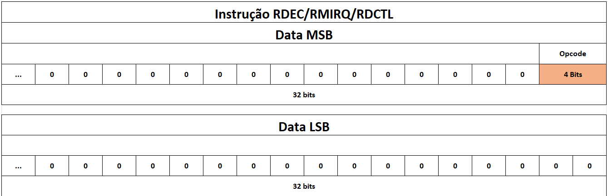
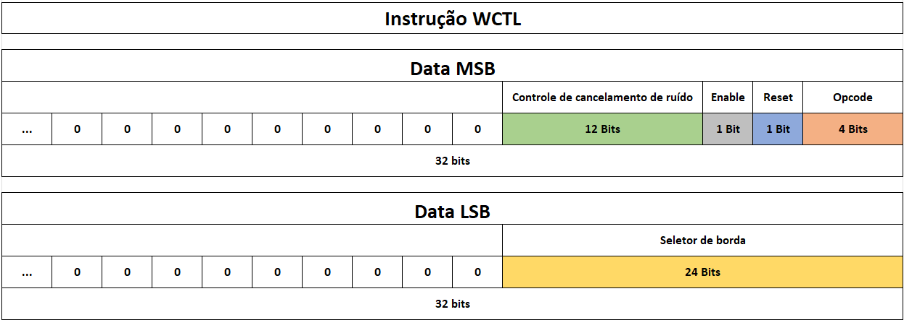
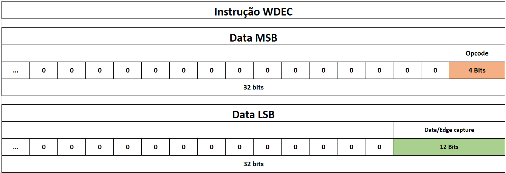
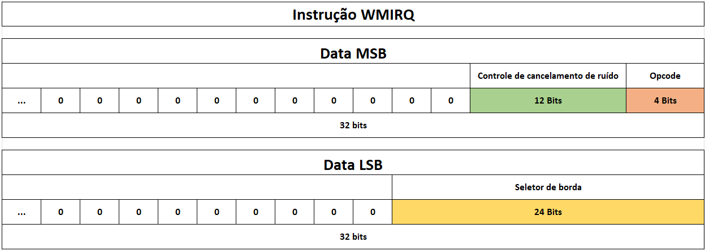
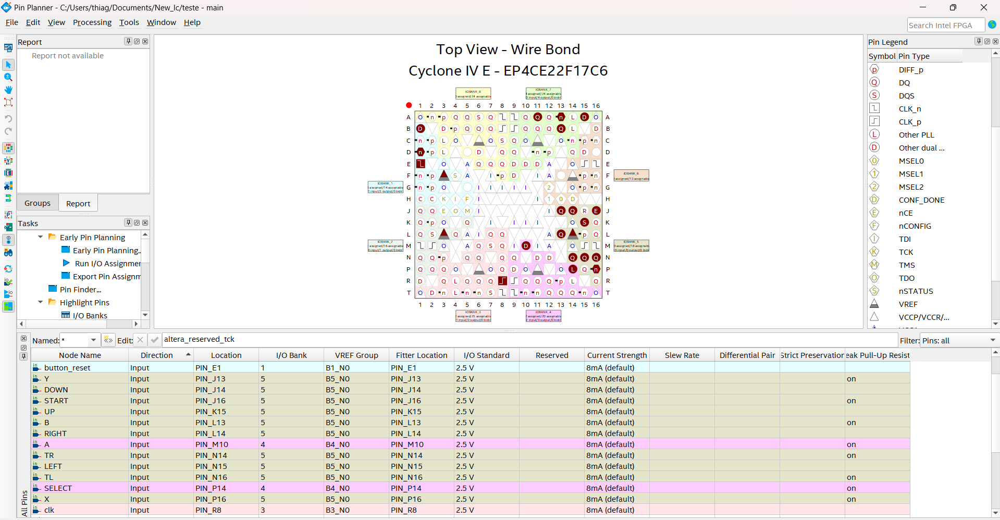

<h1 align="center">Modulo de I/O
</h1>

<h3 align="center"> Projeto de Desenvolvimento de uma Interface de Entrada e Saída para Controle de Videogame Usando FPGA
</h3>


<div align="justify"> 
<h2>Descrição do Projeto</h2>

O gerenciamento de dispositivos de Entrada/Saída, com a sigla E/S (em inglês: *Input/Output*, I/O), sempre foi um grande
desafio na área de sistemas embarcados. Isso se deve tanto à natureza assíncrona dos dados quanto à diferença de velocidade 
entre o processador e os dispositivos periféricos, o que pode afetar significativamente o desempenho da CPU. Para fornecer uma
interface simples e confiável ao usuário e às aplicações, utiliza-se uma estrutura de camadas de hardware (HW) e software 
(SW). Essa organização em camadas permite ocultar os detalhes específicos dos periféricos para as camadas superiores
[ANDREW S. TANENBAUM, 2003]. A Figura 1 ilustra essa arquitetura de camadas entre o software e o hardware.

<p align="center">
  
</p>
<p align="center"><strong>Figura 1: Arquitetura de camadas entre o software e o hardware</strong></p>

Neste projeto, o foco está no gerenciamento dos periféricos de um controle de videogame.
Desenvolveu-se um **módulo de I/O** de 64 *bits* em *Verilog*, uma linguagem de descrição de hardware, 
implementado em uma matriz de portas programáveis (em inglês: *Field-Programmable Gate Array*, com a sigla FPGA) com processador **NIOS II**, acompanhado de uma biblioteca em linguagem C para facilitar o acesso ao hardware. 
O principal objetivo desse módulo é realizar a leitura dos dados dos botões e do joystick. 
Ele é responsável por capturar e armazenar as informações provenientes dos periféricos e transmiti-las
à CPU sob demanda ou via interrupção. Além disso, o módulo processa as configurações solicitadas pela CPU por meio de software. 
Este projeto detalhará o funcionamento do módulo tanto no nível de hardware quanto no nível de software, 
abordando sua arquitetura, interfaces e como os desenvolvedores podem integrá-lo em suas aplicações. Pra se ter uma visão geral do sistema,
a Figura 2 apresenta o diagrama geral do projeto.

<p align="center">
  
</p>
<p align="center"><strong>Figura 2: Visão geral do sistema</strong></p>

</div>


<h2> Autor <br></h2>
<uL>
  <li><a href="https://github.com/TAlmeida003">Thiago Neri dos Santos Almeida</a></li>
  <li>Engenharia de Computação — UEFS</li>
</ul>


<h2> Orientador <br></h2>
<ul>
      <li>Dr. Anfranserai Morais Dias</li>
      <li>Departamento de Tecnologia (DTEC) — UEFS</li>
</ul>


<h1 align="center"> Sumário </h1>
<div id="sumario">
	<ul>
        <li><a href="#VES"> Descrição dos Equipamentos e Software Utilizados </a></li>
        <li><a href="#FH"> Funcinalidades</a></li>
        <li><a href="#DH"> Arquitetura</a></li>
        <li><a href="#D"> Bibliotecas </a></li>
        <li><a href="#AP"> Análise de Pinout </a></li>
        <li><a href="#OCF"> Organização do Código Fonte </a></li>
        <li><a href="#TR">Testes Realizados </a></li>
        <li><a href="#EP"> Execução do Projeto </a></li>
        <li><a href="#referencias"> Referências </a></li>
	</ul>	
</div>


<div align="justify"> 
<div id="VES"> 

<h2>Descrição dos Equipamentos e Software Utilizados</h2>

Nesta seção, serão apresentados os equipamentos e softwares utilizados no desenvolvimento do projeto, incluindo a placa FPGA DE0-Nano, o Game HAT, o software Quartus Lite, o ambiente Eclipse, o ModelSim e o processador NIOS II.

<h3>Kit FPGA DE0-Nano</h3>

O **Kit FPGA DE0-Nano**, baseado na FPGA **Altera Cyclone IV EP4CE22F17C6N**, é uma plataforma de desenvolvimento ideal para projetos de hardware e sistemas embarcados. A FPGA possui 22.320 elementos lógicos, 594 Kbits de memória RAM interna, 66 multiplicadores e 4 PLLs para controle de clock, proporcionando um excelente desempenho e flexibilidade. Com 256 pinos disponíveis, o kit é amplamente utilizado em aplicações que exigem processamento eficiente e personalizável, como sistemas embarcados, controle industrial e processamento de sinais digitais. A imagem a seguir mostra o kit FPGA DE0-Nano e seus principais componentes.

<p align="center">
  
</p>
<p align="center"><strong>Figura 3: Kit FPGA DE0-Nano</strong></p>

<h3>Game Hat</h3>

O **Game HAT** é uma placa de expansão projetada para transformar o Raspberry Pi em um console portátil de videogame. Ele possui uma tela LCD de 3,5 polegadas, botões físicos, um D-pad, além de interfaces para áudio e bateria, proporcionando uma experiência de jogo completa. O Game HAT é compatível com vários emuladores e sistemas operacionais, como o RetroPie, permitindo rodar jogos clássicos de diversas plataformas. Essa solução é ideal para entusiastas de jogos retrô que buscam criar seus próprios consoles portáteis usando o Raspberry Pi. A imagem a seguir mostra o Game HAT.

<p align="center">
  
</p>
<p align="center"><strong>Figura 4: Game HAT</strong></p>

<h3>Quartus Lite</h3>

O **Quartus Lite** é uma edição gratuita do software Quartus Prime, desenvolvido pela Intel (anteriormente conhecida como Altera). Essa ferramenta é empregada no projeto, simulação e programação de dispositivos de lógica programável, como uma FPGA ou um
Dispositivo lógico complexo programável (em inglês: *Complex Programmable Logic Device*, com sigla CPLD). No contexto deste projeto, o Quartus Lite desempenhou um papel fundamental ao ser utilizado para programar a placa FPGA e, posteriormente, transmitir essa programação por meio do *USB-Blaster*, que está integrado à placa e conectado à porta USB do computador
[Intel, 2024].

<h3>Eclipse</h3>

O **Eclipse** do Quartus é um ambiente de desenvolvimento integrado (IDE) baseado no Eclipse, utilizado para desenvolver software embarcado em sistemas com o processador NIOS II. Ele permite a criação, depuração e compilação de aplicativos em C/C++ para sistemas embarcados, oferecendo ferramentas específicas para programação de FPGAs da Intel (Altera). O ambiente facilita a integração entre o hardware descrito no Quartus e o software, permitindo o controle eficiente de periféricos e outras funções no sistema embarcado.

<h3>ModelSim</h3>

O **ModelSim** é uma ferramenta de simulação de hardware amplamente utilizada para simular o comportamento de circuitos digitais. É uma ferramenta essencial no desenvolvimento e verificação de projetos de lógica digital, incluindo circuitos integrados e FPGA. Permite criar modelos de simulação de circuitos digitais e executar testes para verificar o funcionamento correto antes de implementar o projeto em hardware real.

O ModelSim é essencial no desenvolvimento de hardware digital, pois ajuda a identificar erros, depurar problemas e otimizar o design, economizando tempo e recursos. Além da simulação funcional, suporta simulação de tempo, considerando atrasos e características temporais, permitindo verificar o desempenho em tempo real.

<h3>NIOS II</h3>

O **NIOS II** é um processador soft-core da Intel (Altera), projetado para ser usado em FPGAs, como a Cyclone IV. Ele permite personalizar o processador conforme as necessidades do projeto, ajustando dados, caches e outros recursos. Utilizado em sistemas embarcados, o NIOS II realiza tarefas como controle de periféricos e processamento de sinais, sendo programado em C/C++. Com o Quartus e o ambiente Eclipse, ele oferece uma solução flexível e eficiente para controle e processamento de hardware.

<h3>PIO Core</h3>

O  ***Parallel Input/Output Core***, com sigla PIO Core, é um componente de hardware em FPGAs que gerencia entradas e saídas de dados, permitindo que o processador, como o NIOS II, se comunique com dispositivos externos. Ele lê sinais de botões e armazena os dados no modo de entrada, enquanto no modo de saída, envia informações do processador para controlar dispositivos como LEDs. Além disso, o PIO Core pode gerar interrupções para avisar o processador sobre eventos importantes, tornando o gerenciamento de entradas e saídas mais eficiente.
</div>
</div>


<div align="justify"> 
<div id="FH"> 

<h2>Funcinalidades</h2>

Nesta seção, serão apresentadas as funcionalidades do módulo de I/O, que incluem o gerenciamento dos dados dos botões e do joystick, além do controle de interrupções.

<h3>Gerenciamento de Botões e Joystick</h3>

O módulo de hardware desenvolvido realiza a leitura dos dados dos botões e do joystick, armazenando-os em registradores internos. O sistema suporta 8 botões (Y, X, A, B, TL, TX, START e SELECT) e um joystick com 4 direções (UP, DOWN, LEFT e RIGHT). Para cada botão e direção do joystick, é possível ler o estado atual e o estado de borda (subida, descida ou ambos).

Os dados dos botões e do joystick são armazenados em registradores de 64 bits, permitindo a leitura simultânea de todos os botões e direções. O módulo também conta com registradores de controle que permitem habilitar ou desabilitar a leitura dos botões e do joystick, além de configurar o controle de borda e sua seleção. 

Além disso, o módulo possui regisradores de captura de borda que armazenam as mudanças de borda dos periféricos, permitindo a detecção de bordas para que o processador possa identificar que um botão foi pressionado ou o joystick foi movido, mesmo que o estado do periférico tenha mudado. Isso é útil para
poder detectar eventos mesmo que o processador não tenha lido o estado do periférico no momento da mudança. 

> **Observação:** Os registradores armazenam o estado de borda para leitura pelo processador. Ao realizar a leitura, é necessário limpar o registrador de captura de borda via software.

<h3>Controle de Interrupção</h3> 

O módulo de I/O oferece suporte a interrupções para notificar o processador sobre eventos importantes, como a pressão de um botão ou o movimento do joystick. Quando um botão é pressionado ou o joystick é movido, o módulo gera uma interrupção que permite ao processador tratar o evento imediatamente. Isso possibilita uma resposta rápida a entradas, eliminando a necessidade de verificar constantemente os botões e o joystick.

Além disso, o módulo possui registradores de máscara de interrupção que permitem habilitar ou desabilitar interrupções específicas, possibilitando a seleção de quais eventos devem acionar interrupções.

A interrupção pode ser configurada para borda ou nível, permitindo que o processador seja notificado quando um botão é pressionado ou solto, ou quando o joystick é movido em uma direção específica. Isso torna o controle de interrupção mais flexível e eficiente, garantindo que o processador possa responder rapidamente a eventos de entrada.

</div>
</div>


<div align="justify"> 
<div id="DH"> 

<h2>Arquitetura do Modulo de I/O</h2>


<h3>Interface do modulo de I/O</h3>

Para se comunicar com o barramento de sistema, o modulo de I/O é equipado com 145 pinos. Para facilitar a compreensão da organização desses pinos, a tabela a seguir fornece uma visão detalhada de cada um deles.


<div align="center">

| Nome   | Tipo       | tamanho |         Descrição         |
|--------|------------|---------|---------------------------|
| clk    | Entrada    | 1       | Sinal de clock de entrada |
| rst_n  | Entrada    | 1       | Sinal de reset ativo em nível baixo |
| we     | Entrada    | 1       | Sinal de escrita ativo em nível alto |
| buttons| Entrada    | 8       | Barramento para leitura dos botões |
| joystick| Entrada   | 4       | Barramento para leitura do joystick |
| writedata| Entrada  | 64      | Barramento para escrita de dados |
| readdata| Saída     | 64      | Barramento para leitura de dados |
| waitrequest| Saída  | 1       | Sinal para indicar que o módulo está ocupado |
| irq    | Saída      | 1       | Sinal de interrupção para o processador |
</div>
<p align="center">
<strong> Tabela 1: Pinagem do módulo de I/O</strong></p>

A Figura 5 apresenta o diagrama em blocos da interface do módulo de I/O, mostrando os sinais de entrada e saída, bem como os barramentos de dados e controle.

<p align="center">
  
</p>
<p align="center"><strong>Figura 5: Diagrama em blocos da interface do módulo de I/O</strong></p>

<h3>Discrição Geral</h3>

Nesta seção, primeiro precisamos ter uma compreensão geral de todo o projeto experimental. Primeiro, vamos dar uma olhada no diagrama de blocos geral do projeto, conforme mostrado na Figura 6.

<h4>Controle</h4>

O **módulo de Controle** gerencia o estado das configurações do módulo de I/O e a máscara de interrupção. 
Ele contém um **registrador de controle**, acessível pelo endereço 0, com várias funções: um bit para reiniciar **(RST)** o módulo 
(0 para reiniciar e 1 para manter o estado atual), um bit de enable (0 para desativar o módulo e impedir alterações, e 1 para 
permitir modificações), um bit para habilitar ou desabilitar o cancelamento de ruído **(RCR)** (0 para usar o sinal atual do botão e 1 
para ativar os registradores de captura de borda), e um seletor de borda ou nivel **(CCR)** que pode ser configurado como descida (00), subida (01), ambas (10) ou nivel (11). Cada um dos 12 periféricos de entrada possui um espaço no registrador para controlar o tipo de dado e a borda.
A figura a seguir ilustra a organização dos registradores de controle.

<p align="center">
  
</p>
<p align="center"><strong>Figura 6: registrador de controle</strong></p>

Além disso, o módulo de I/O inclui um **registrador de máscara de interrupção**, acessível pelo endereço 2, 
que permite habilitar ou desabilitar interrupções específicas. Cada bit desse registrador corresponde a um
periférico de entrada, permitindo a seleção de quais devem acionar a interrupção **(IRQ)**. Também há dois bits 
reservados para cada periférico, permitindo definir a borda na qual a interrupção será acionada **(CCR)**. A figura 
a seguir mostra a estrutura do registrador de máscara de interrupção.

<p align="center">
  
</p>
<p align="center"><strong>Figura 7: registrador de máscara de interrupção</strong></p>

Por fim, o módulo conta com as seguintes entradas e saídas:

<div align="center">

| Nome   | Tipo       | tamanho |         Descrição         |
|--------|------------|---------|---------------------------|
| clk    | Entrada    | 1       | Sinal de clock de entrada |
| rst_n  | Entrada    | 1       | Sinal de reset ativo em nível baixo |
| we     | Entrada    | 1       | Sinal de escrita ativo em nível alto |
|register_addr | Entrada | 2       | Barramento para endereço do registrador |
|wr_data | Entrada    | 64      | Barramento para escrita de dados |
|out_control | Saída   | 64      | Barramento para leitura de dados do registrador de controle|
|out_interrupt| Saída   | 64      | Barramento para leitura dedados do registrador de máscara de interrupção|
|done | Saída   | 1      | Sinal que indica se a escrita foi realizada com sucesso

</div>
<p align="center">
<strong> Tabela 2: Entradas e saídas do módulo de controle</strong></p>

Para facilitar a visualização segue uma imagem do diagrama de blocos do módule.

<h4>Edge Capture Clear</h4>

O **módulo Edge Capture Clear** é responsável por limpar os registradores de captura de borda, que armazenam as mudanças de estado dos periféricos. Ele é ativado pelo processador, que envia um sinal de escrita para realizar a limpeza. Para acessar este módulo, o processador deve escrever no endereço 1, correspondente ao registrador de dados. Ao escrever o valor 1 no bit que representa o periférico desejado **(RS)**, o respectivo registrador de captura de borda é limpo. A figura a seguir ilustra a estrutura do registrador de captura de borda e dados.

<p align="center">
  
</p>
<p align="center"><strong>Figura 8: registrador de dados e captura de borda</strong></p>

> **Observação:** O sinal de limpeza depende da configuração de borda do registrador de controle. Por exemplo, se a borda estiver configurada como subida, a limpeza ocorrerá apenas no registrador de subida, e os demais registradores não serão afetados.

O módulo conta com as seguintes entradas e saídas:

<div align="center">

| Nome   | Tipo       | tamanho |         Descrição         |
|--------|------------|---------|---------------------------|
|clk    | Entrada    | 1       | Sinal de clock de entrada |
|rst_n  | Entrada    | 1       | Sinal de reset ativo em nível baixo |
|we     | Entrada    | 1       | Sinal de escrita ativo em nível alto |
|enable | Entrada    | 1       | Sinal de habilitação da limpeza |
|register_addr | Entrada | 2       | Barramento para endereço do registrador |
|wr_data | Entrada    | 64      | Barramento para escrita de dados |
|noise_canc | Entrada    | 64      | Barramento para limpeza de ruído |
|clear_data | Saída   | 64      | Barramento para leitura de dados limpos |
|done | Saída   | 1      | Sinal que indica se a escrita foi realizada com sucesso

</div>
<p align="center">
<strong> Tabela 3: Entradas e saídas do módulo de limpeza de borda</strong></p>

Para garantir a visualização do módulo, segue a imagem do diagrama de blocos do módulo.

<h4>IO Data</h4>

O **módulo IO Data** é responsável por armazenar os dados dos botões e do joystick. Ele contém quatro registradores de 1 bit para cada periférico: três registradores para captura de borda (subida, descida e ambas) e um para o estado atual. Dessa forma, os registradores de captura de borda e o sinal de interrupção, que dependem desses registradores, são gerenciados dentro deste módulo.

A saída de dados do módulo é controlada pelo registrador de controle, que determina se o dado a ser lido é referente às bordas ou ao estado atual. Para habilitar os registradores de captura de borda, é necessário ativar o sinal de enable do módulo, assim como o **Registrador de Cancelamento de Ruído (RCR)**. Caso o enable esteja ativado, mas o RCR não, os registradores de captura de borda não serão capazes de alterar seu estado.

Uma decisão importante no design foi utilizar uma única saída multiplexada para selecionar o tipo de dado a ser lido, o que economiza espaço e simplifica o controle de dados.

Por exemplo, se o usuário deseja ler o estado atual do botão Y, ele deve escrever o valor **11** na seção correspondente ao botão Y no registrador de controle (CCR). Isso direcionará a saída do módulo IO Data para o estado atual do botão Y. Da mesma forma, para ler as bordas, o usuário precisa ativar o enable e o RCR, e então escrever o valor **00** no campo CCR.

A interrupção é gerada quando um dos registradores de dados detecta uma mudança de borda ou quando o valor atual do periférico é baixo, uma vez que todos os periféricos funcionam como ***pull-up***. Para habilitar a interrupção, o usuário deve escrever o valor **1** no campo correspondente ao periférico desejado no registrador de máscara de interrupção, assim como configurar o tipo de interrupção.

O módulo conta com as seguintes entradas e saídas:

<div align="center">

| Nome   | Tipo       | tamanho |         Descrição         |
|--------|------------|---------|---------------------------|
|clk    | Entrada    | 1       | Sinal de clock de entrada |
|rst_n  | Entrada    | 1       | Sinal de reset ativo em nível baixo |
|enable | Entrada    | 1       | Sinal de habilita os registradores|
| en_noise_cancelling | Entrada    | 12       | Barramento para habilitar o registradores de captura de borda |
|interrupt_mask | Entrada    | 12       | Barramento para habilitar a interrupção |
|in_data | Entrada    | 8       | Barramento para leitura dos botões |
|select_edge | Entrada    | 24       | Barramento para seleção de borda |
|select_interrupt | Entrada    | 24       | Barramento para seleção de tipo de interrupção|
|out_data | Saída   | 64      | Barramento para leitura de dados |
|irq | Saída   | 1      | Sinal de interrupção|

</div>
<p align="center">
<strong> Tabela 4: Entradas e saídas do módulo de IO Data</strong></p>

Para garantir a visualização do módulo, segue a imagem do diagrama de blocos do módulo.

<h4>MUX</h4>

O **módulo MUX** é responsável por selecionar o tipo de dado que será lido pelo processador. Ele usa como entrada de seleção o endereço dos registradore e assim pode ter as sequintes saídas:

<div align="center">

|Endereço |        Descrição         |
|--------|---------------------------|
| 0b00      | Registrador de dados     |
| 0b01      | Registrador de controle  |
| 0b10      | Registrador de máscara de interrupção |
| 0b11      |  Não utilizado |

</div>
<p align="center">
<strong> Tabela 5: Saídas do módulo MUX</strong></p>

<h4>Opcode Control</h4>

O **módulo Opcode Control** é responsável por interpretar os 
opcodes enviados e direcionalos corretamente para o módulo.
Nesse sentido, a nivel de hardware, o módulo é capaz de interpretar o formato dos dados tanto de 32 bits quanto de 64 bits, montando os dados para cada um dos formatos. 

Em caso de envio de opcode que não pertence ao módulo,
o módulo zera a saída para evitar erros de leitura. Usando o
endereço 0b11, o módulo não realiza nenhuma operação.

O módulo conta com as seguintes entradas e saídas:

<div align="center">

| Nome   | Tipo       | tamanho |         Descrição         |
|--------|------------|---------|---------------------------|
|in_reg_data | Entrada    | 64       | Barramento com os dados de enviados pelo processador |
|opcode | Entrada    | 4       | Barramento com os opcodes enviados pelo processador |
|out_reg_data | Saída   | 64      | Barramento com os dados de entrada do módulo |
|we | Saída   | 1      | Sinal de escrita |
|addr | Saída   | 2      | Barramento com o endereço do registrador|

</div>

<p align="center">
<strong> Tabela 6: Entradas e saídas do módulo Opcode Control</strong></p>

Para garantir a visualização do módulo, segue a imagem do diagrama de blocos do módulo.


<h3> Comunicação com o Processador</h3>

O módulo de I/O é controlado pelo processador NIOS II, que envia comandos para ler e escrever dados nos registradores internos do módulo. Para realizar essa comunicação, utiliza-se acesso direto à memória, sem o uso de mapeamento de memória. O processador se comunica com todos os módulos da arquitetura através do barramento **Avalon MM** de 32 bits. Para acomodar o módulo de I/O, foi definida uma estrutura de 64 bits, visando a compatibilidade com projetos futuros.

Para integrar o barramento Avalon ao módulo de I/O, foi necessário implementar um intermediário. Embora essa decisão tenha acarretado a perda de alguns sinais de controle, ela permitiu manter a estrutura de 64 bits para expansões futuras. Para utilizar a leitura de dados, o processdor deve escrever o registrador desejado com base no **conjunto de instrução** e, em seguida, ler o valor do registrador de saída.

A comunicação entre o processador e o módulo de I/O é realizada por meio do **PIO-Core**, utilizando quatro módulos de 32 bits (dois para escrita e dois para leitura). Além disso, um módulo específico para escrita, o **módulo de pulso de escrita**, foi implementado. Esse módulo capta o sinal de um endereço de memória e gera um pulso para o módulo de I/O. Para efetuar a escrita, o processador deve primeiro atribuir o valor 1 ao endereço de memória correspondente e, em seguida, atribuir o valor 0 ao mesmo endereço, garantindo assim que o módulo de I/O realize a operação de escrita.

A seguir, está o diagrama de blocos que ilustra a arquitetura completa do sistema, facilitando a visualização dessa estrutura.


<h3>Conjunto de Instruções</h3>

O módulo de I/O suporta um conjunto de instruções para comunicação com o processador. 
Essas instruções permitem ler e escrever dados nos registradores internos do módulo, bem como configurar os 
parâmetros de controle. A tabela a seguir apresenta o conjunto de instruções suportadas pelo módulo de I/O.


<div align="center">

| Opcode | Instrução |         Descrição         |
|--------|-----------|---------------------------|
| 0x04   |  RDEC     | Lê o registrador de dados/edgeCapture|
| 0x05   |  RCTL     | Lê o registrador de controle|
| 0x06   |  RMIRQ    | Lê o registrador de máscara de interrupção|
| 0x07   |  WDEC     | Escreve no registrador de dados/edgeCapture|
| 0x08   |  WCTL     | Escreve no registrador de controle|   
| 0x09   |  WMIRQ    | Escreve no registrador de máscara de interrupção|

</div>

<p align="center">
<strong> Tabela 6: Opcodes da interface de comunicação</strong></p>

<h4> Instruções RCTL, RDEC e RMIRQ</h4>

As **instruções RCTL, RDEC e RMIRQ** são usadas para ler registradores específicos: RCTL lê o registrador de controle, 
RDEC lê o registrador de dados/captura de borda (*edgeCapture*), e RMIRQ lê o registrador de máscara de interrupção. 
Quando o opcode correspondente ao registrador é escrito, o valor do registrador respectivo é enviado para os registradores de 
leitura. A figura a seguir ilustra o formato dessas instruções.

<p align="center">  </p> <p align="center"><strong> Figura: Formato das instruções RCTL, RDEC e RMIRQ</strong></p>

Para uso na arquitetura de 32 bits, a instrução é dividida em duas partes: a primeira (32 bits mais significativos, sigla MSB) parte
 contém o opcode, enquanto a segunda (32 bits menos significativos, sigla LSB) parte é um campo vazio, reservado para possíveis expansões ou configurações adicionais.

<p align="center">  </p> <p align="center"><strong> Figura: Formato das instruções RCTL, RDEC e RMIRQ com 32 bits</strong></p>

<h4> Instrução WCTL</h4>

A **instrução WCTL** é usada para escrever no registrador de controle. O processador deve enviar o opcode correspondente ao registrador de controle, seguido pelo valor a ser escrito. A figura a seguir ilustra o formato dessa instrução.

<p align="center">
  
</p>
<p align="center"><strong> Figura: Formato da instrução WCTL</strong></p>

Para uso na arquitetura de 32 bits, a instrução é dividida em duas partes: a primeira (MSB) parte contém o opcode, o sinal de enable, o sinal de reset e o sinal de cancelamento de ruído, enquanto a segunda (LSB) parte contém o seletor de borda. 
A figura a seguir ilustra o formato dessa instrução para 32 bits.

<p align="center">
  
</p>
<p align="center"><strong>  Figura: Formato da instrução WCTL para 2 partes de 32 bits</strong></p>

<h4> Instrução WDEC</h4>

A **instrução WDEC** é usada para escrever no registrador de dados/captura de borda (*edgeCapture*). Ao Utilizar essa instrução, os regisradores de captura de borda são limpos nos locais onde o valor 1 é escrito. A figura a seguir ilustra o formato dessa instrução.

<p align="center">
  
</p>
<p align="center"><strong>Figura: Formato da instrução WDEC</strong></p>

Para uso na arquitetura de 32 bits, a instrução é dividido em duas partes: a primeira (MSB) parte contém o opcode, enquanto a segunda (LSB) parte é os registradores de captura de borda a serem limpos. A figura a seguir ilustra o formato dessa instrução para 32 bits.

<p align="center">
  
</p>
<p align="center"><strong> Figura: Formato da instrução WDEC para 2 partes de 32 bits</strong></p>

<h4> Instrução WMIRQ</h4>

A **instrução WMIRQ** é usada para escrever no registrador de máscara de interrupção. Ela permite habilitar ou desabilitar interrupções específicas, configurando o tipo de interrupção para cada periférico. A figura a seguir ilustra o formato dessa instrução.

<p align="center">
  
</p>
<p align="center"><strong> Figura: Formato da instrução WMIRQ</strong></p>

Para uso na arquitetura de 32 bits, a instrução é dividida em duas partes: a primeira (MSB) parte contém o opcode e a seleção de interrupção, enquanto a segunda (LSB) parte é o seletor de borda. A figura a seguir ilustra o formato dessa instrução para 32 bits.

<p align="center">
  
</p>
<p align="center"><strong> Figura: Formato da instrução WMIRQ para 2 partes de 32 bits</strong></p>


</div>
</div>


<div align="justify"> 
<div id="D"> 

<h2>Biblioteca</h2>

Para facilitar o uso do módulo de I/O, foi desenvolvida uma biblioteca em C que contém funções para inicializar, finalizar e ler os dados dos botões e do joystick, chamada `joystick_io.h`. Ela encontrasse no diretótio `src/software/lib_joystick` do projeto. Para se utilizar essa biblioteca, basta incluir o arquivo `joystick_io.h` no código do projeto.

```c
#include "joystick_io.h"
```

Para entender como utilizar as funções da biblioteca e suas constantes, a seguir será explicado o funcionamento de cada uma delas.

<h3>Constantes</h3>

Para facilitar o uso do módulo de I/O, foram definidas algumas
constantes que representam o botões, as direções do joystick e 
as formas de leitura dos botões e do joystick. A tabela a seguir mostra as constantes definidas na biblioteca.

<div align="center">

|Constante         | Valor | Descrição |
|------------------|-------|-----------|
| SELECT_BUTTON    | 0     | Representação do botão SELECT |
| START_BUTTON     | 1     | Representação do botão START |
| TL_BUTTON        | 2     | Representação do botão TL |
| TR_BUTTON        | 3     | Representação do botão TR |
| B_BUTTON         | 4     | Representação do botão B |
| A_BUTTON         | 5     | Representação do botão A |
| Y_BUTTON         | 6     | Representação do botão Y |
| X_BUTTON         | 7     | Representação do botão X |
| LEFT_DIR      | 8     | Representação da direção LEFT do joystick |
| RIGHT_DIR     | 9     | Representação da direção RIGHT do joystick |
| UP_DIR        | 10    | Representação da direção UP do joystick |
| DOWN_DIR      | 11    | Representação da direção DOWN do joystick |
| POS_EDGE  | 0     | Representação da borda de subida |
| NEG_EDGE  | 1     | Representação da borda de descida |
| BOTH_EDGE | 2     | Representação de ambas as bordas |
| LEVEL    | 3     | Representação do estado atual do botão ou direção do joystick |

</div>


<h3>Funções</h3>

`initialize_joystick`: Inicializar o módulo de I/O para leitura dos botões e do joystick. Ao chamar essa função o módulo é reiniciado tendo os valores de controle zerados e é habilitado o sinal de enable. Além disso, é habilitado o cancelamento de ruído.

**parâmetros:** 
A função não recebe parâmetros.

**retorno:** 
A função não retorna nada.

**exemplo de uso:**
```c
initialize_joystick();
```

> **Observação:** A função deve ser chamada antes de qualquer outra função.

`close_joystick`: Finalizar o módulo de I/O zerando todos os valores de controle.

**parâmetros:**
A função não recebe parâmetros.

**retorno:**
A função não retorna nada.

**exemplo de uso:**
```c
close_joystick();
```

> **Observação:** A função  deve ser chamada ao final do programa para liberar os recursos utilizados pelo módulo de I/O.

`read_KEY`: Ler o estado de um botão específico. Esta função permite verificar o estado de um botão, identificando se houve uma mudança (borda) ou apenas o estado atual do botão.

**parâmetros:**

- `KEY`: O botão a ser lido. Deve ser uma das constantes definidas na biblioteca, como `Y`, `X`, `A`, `B`, `TL`, `TX`, `START` ou `SELECT`.

- `state`: estado a ser verificado. Pode ser uma das seguintes constantes:

  - `POS_EDGE`: Verifica se o botão foi pressionado (borda de subida);

  - `NEG_EDGE`: Verifica se o botão foi solto (borda de descida);

  - `BOTH_EDGE`: Verifica se houve uma mudança de borda no botão;

  - `LEVEL`: Lê o estado atual do botão, sem considerar mudanças de borda.

**retorno:**

A função retorna **1** se o botão estiver no estado especificado e **0** caso contrário.

**exemplo de uso:**
```c
// Verificando se o botão Y foi pressionado

if (read_KEY(Y, POS_EDGE)) {
    // Botão Y foi pressionado
}
```

```c
// Verificando se o botão B foi solto

if (read_KEY(B, NEG_EDGE)) {
    // Botão B foi solto
}
```

```c
// Verificar se houve uma mudança de borda no botão A

if (read_KEY(A, BOTH_EDGE)) {
    // Botão A teve uma mudança de borda
}
```

```c
// Verificar o estado atual do botão X

if (read_KEY(X, LEVEL)) {
    // Botão X está pressionado
}
```

`read_JOYSTICK`: Ler o estado de uma direção específica do joystick. Esta função permite verificar o estado de uma direção do joystick, identificando se houve uma mudança (borda) ou apenas o estado atual da direção.

**parâmetros:**

- `direction`: A direção do joystick a ser lida. Deve ser uma das constantes pré-definidas na biblioteca, como `UP`, `DOWN`, `LEFT`, `RIGHT`.

- `state`: estado a ser verificado. Pode ser uma das seguintes constantes:

  - `POS_EDGE`: Verifica se a direção foi ativada (borda de subida);

  - `NEG_EDGE`: Verifica se a direção foi desativada (borda de descida);

  - `BOTH_EDGE`: Verifica se houve uma mudança de borda na direção;

  - `LEVEL`: Lê o estado atual da direção, sem considerar mudanças de borda.

**retorno:**

A função retorna **1** se a direção estiver no estado especificado e **0** caso contrário.

**exemplo de uso:**
```c
// Verificando se a direção UP foi ativada (borda de subida)
if (read_JOYSTICK(UP, POS_EDGE)) {
    // A direção UP foi pressionada
}
```

```c
// Verificando se a direção LEFT foi desativada (borda de descida)
if (read_JOYSTICK(LEFT, NEG_EDGE)) {
    // A direção LEFT foi solta
}
```

```c
// Verificando se houve uma mudança de borda na direção RIGHT
if (read_JOYSTICK(RIGHT, BOTH_EDGE)) {
    // A direção RIGHT teve uma mudança de borda
}
```

```c
// Verificando o estado atual da direção DOWN
if (read_JOYSTICK(DOWN, LEVEL)) {
    // A direção DOWN está sendo pressionada
}
```


`set_callback`: Configurar uma função de callback para ser chamada quando uma interrupção for gerada. Esta função permite definir uma função de callback que será chamada quando uma interrupção for gerada pelo módulo de I/O.

**parâmetros:**

- `callback`: Ponteiro para a função de callback. A função de callback deve ter o seguinte protótipo:

```c
void callback(void)
```

**retorno:**
Sem retorno.

**exemplo de uso:**
```c
void my_callback() {
    // Função de callback
}

set_callback(my_callback);
```

> **Observação:** As funções de callback devem ser definidas
pelo usuário, a biblioteca não fornece a logica de limpeza de interrupção de borda, essa deve ser feita pelo usuário, usando a função `read_JOYSTICK` ou `read_KEY` para limpar a interrupção.


`peripheral_enable_callback`: Habilita um periférico específico para gerar interrupções em uma borda específica.

**parâmetros:**

- `peripheral`: O periférico a ser habilitado. Deve ser uma das constantes pré-definidas na biblioteca, como `Y`, `X`, `A`, `B`, `TL`, `TX`, `START` ou `SELECT`.

- `state`: A borda na qual a interrupção deve ser gerada. Deve ser uma das constantes pré-definidas na biblioteca, como `POS_EDGE`, `NEG_EDGE`, `BOTH_EDGE` ou `LEVEL`.

**retorno:**
Sem retorno.

**exemplo de uso:**
```c
// Habilitando o botão Y para gerar interrupções na borda de subida
peripheral_enable_callback(Y, POS_EDGE);
```
```c
// Habilitando a direção UP do joystick para gerar interrupções na borda de descida
peripheral_enable_callback(UP, NEG_EDGE);
```
```c
// habilitando o botão SELECT para gerar interrupção em troca de borda
peripheral_enable_callback(SELECT, BOTH_EDGE);
```
```c
// habilitando o botão START para gerar interrupção por nivel
peripheral_enable_callback(START, LEVEL);
```


`peripheral_disable_callback`: Desabilita um periférico específico para gerar interrupções.

**parâmetros:**

- `peripheral`: O periférico a ser desabilitado. Deve ser uma das constantes pré-definidas na biblioteca, como `Y`, `X`, `A`, `B`, `TL`, `TX`, `START` ou `SELECT`.

**retorno:**
Sem retorno.

**exemplo de uso:**
```c
peripheral_disable_callback(Y);
```

</div>
</div>


<div align="justify"> 
<div id="AP"> 


<h2>Análise de Pinout</h2>

Para utilizar o projeto é necessário usar alguns pinos e periféricos da FPGA DE0-Nano. A tabela a seguir mostra a pinagem utilizada no projeto.

<div align="center">

| PIN | Name PIN | FPGA PIN | Função             |
|-----|----------|----------|--------------------|
| 39  | GPIO0_132 | PIN_J13 | Botão Y            |
| 37  | GPIO0_130 | PIN_C3  | Botão START        |
| 35  | GPIO0_128 | PIN_A3  | Botão A            |
| 33  | GPIO0_126 | PIN_B4  | Direcional RIGHT   |
| 31  | GPIO0_124 | PIN_B5  | Direcional LEFT    |
| 40  | GPIO0_133 | PIN_D5  | Direcional DOWN    |
| 38  | GPIO0_131 | PIN_A6  | Direcional UP      |
| 36  | GPIO0_129 | PIN_D6  | Botão B            |
| 34  | GPIO0_127 | PIN_C6  | Botão TR           |
| 32  | GPIO0_125 | PIN_E6  | Botão SELECT       |
| 28  | GPIO0_123 | PIN_F8  | Botão TL           |
| 26  | GPIO0_121 | PIN_D8  | Botão X            |
| -   | CLOCK_50  | PIN_R8  | CLOCK principal    |
| -   | KEY1      | PIN_E1  | Botão de reset     |

</div>

<p align="center">
<strong> Tabela: Pinagem do FPGA De0-Nano</strong></p>

Para utilizar os botões do controle foi ncessario utilizar um resistor de *pull-up* interno da FPGA, para isso foi necessário configurar o pino como entrada e ativar o resistor de *weak pull-up resistor*. Para visualizar
como foi feito a configuração dos pinos, segue o *chip planner* do Quartus.

<p align="center">
  
</p>
<p align="center"><strong>Figura: Chip Planner do Quartus</strong></p>

</div>
</div>


<div align="justify"> 
<div id="AR"> 

<h2>Análise de Recursos</h2>


</div>
</div>


<div align="justify"> 
<div id="OCF"> 

<h2>Organização do Código Fonte</h2>

</div>
</div>


<div align="justify"> 
<div id="TR"> 

<h2>Testes Realizados</h2>

</div>
</div>


<div align="justify"> 
<div id="referencias"> 
<h2>Referências</h2>

> Tanenbaum, Andrew S. **Organização Estruturada de Computadores**. 5. ed. São Paulo: Pearson Prentice Hall, 2003.
>
> Intel. **Software de projeto Quartus® Prime**. Disponível em: <https://www.intel.com.br/content/www/br/pt/products/details/fpga/development-tools/quartus-prime.html>
>
> Embedfire. **Design e verificação do bibliotecar de vídeo HDMI**. Disponível em: <https://doc.embedfire.com/fpga/altera/ep4ce10_pro/zh/latest/code/hdmi.html>.
>
> Ti. **PMP10580 DE0-Nano User Manual (Terasic/Altera)**.Disponível em: <https://www.ti.com/lit/ug/tidu737/tidu737.pdf>.

</div>
</div>
