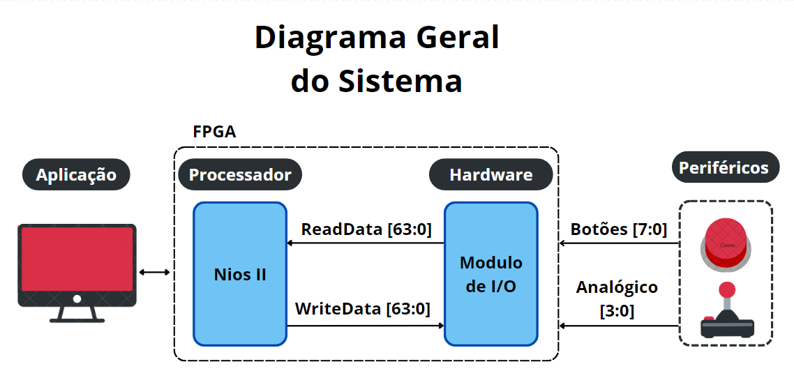

<h1 align="center">Modulo de I/O
</h1>

<h3 align="center"> Projeto de Desenvolvimento de uma Interface de Entrada e Saída para Controle de Videogame Usando FPGA
</h3>


<div align="justify"> 
<h2>Descrição do Projeto</h2>

O gerenciamento de dispositivos de Entrada/Saída, com a sigla E/S (em inglês: Input/Output, I/O), sempre foi um grande desafio na área de sistemas embarcados. Isso se deve tanto à natureza assíncrona dos dados quanto à diferença de velocidade entre o processador e os dispositivos periféricos, o que pode afetar significativamente o desempenho da CPU. Para fornecer uma interface simples e confiável ao usuário e às aplicações, utiliza-se uma estrutura de camadas de hardware (HW) e software (SW). Essa organização em camadas permite ocultar os detalhes específicos dos periféricos para as camadas superiores [ANDREW S. TANENBAUM, 2003]. A Figura 1 ilustra essa arquitetura de camadas entre o software e o hardware.

<p align="center">
  
</p>
<p align="center"><strong>Figura 1: Arquitetura de camadas entre o software e o hardware</strong></p>

Neste projeto, focou-se no gerenciamento dos periféricos de um controle de videogame. Desenvolveu-se um **módulo de I/O** em linguagem de descrição de hardware Verilog, implementado em uma FPGA, juntamente com sua biblioteca em linguagem C. O principal objetivo desse módulo é realizar a leitura dos dados dos botões e do joystick. Ele é responsável por capturar e armazenar as informações provenientes dos periféricos e transmiti-las à CPU sob demanda, além de atender às configurações solicitadas pela CPU via software. Este projeto detalhará o funcionamento do módulo tanto no nível de hardware quanto no nível de software, abordando sua arquitetura, interfaces e como os desenvolvedores podem integrá-lo em suas aplicações.

</div>


<h2> Autor <br></h2>
<uL>
  <li><a href="https://github.com/TAlmeida003">Thiago Neri dos Santos Almeida</a></li>
  <li>Engenharia de Computação — UEFS</li>
</ul>


<h2> Orientador <br></h2>
<ul>
      <li>Dr. Anfranserai Morais Dias</li>
      <li>Departamento de Tecnologia (DTEC) — UEFS</li>
</ul>


<h1 align="center"> Sumário </h1>
<div id="sumario">
	<ul>
        <li><a href="#VGS"> Visão Geral do Sistema </a></li>
        <li><a href="#VES"> Descrição dos Equipamentos e Software Utilizados </a></li>
        <li><a href="#FH"> Funcinalidades do Hardware </a></li>
        <li><a href="#DH"> Descrição do Hardware</a></li>
        <li><a href="#D"> Bibliotecas </a></li>
        <li><a href="#AP"> Análise de Pinout </a></li>
        <li><a href="#OCF"> Organização do Código Fonte </a></li>
        <li><a href="#TR">Testes Realizados </a></li>
        <li><a href="#EP"> Execução do Projeto </a></li>
        <li><a href="#referencias"> Referências </a></li>
	</ul>	
</div>


<div align="justify"> 
<div id="VGS"> 

<h2>Visão Geral do Sistema</h2>

<p align="center">
  
</p>
<p align="center"><strong>Figura 2: Visão geral do sistema</strong></p>
</div>
</div>


<div align="justify"> 
<div id="VES"> 

<h2>Descrição dos Equipamentos e Software Utilizados</h2>

<h3>FPGA De0-Nano</h3>

Modelo Altera Cyclone IV **EP4CE22F17C6N** FPGA;

<h3>Game Hat</h3>

<h3>Quartus</h3>

<h3>Eclipse</h3>

</div>
</div>


<div align="justify"> 
<div id="FH"> 

<h2>Funcinalidades do Hardware</h2>

</div>
</div>


<div align="justify"> 
<div id="DH"> 

<h2>Descrição do Hardware</h2>

<h3> Interface de Comunicação</h3>


<div align="center">

| Opcode | Instrução |         Descrição         |
|--------|-----------|---------------------------|
| 0x00   |  RDEC     | Lê o registrador de dados/edgeCapture|
| 0x01   |  RCTL     | Lê o registrador de controle|
| 0x02   |  RMIRQ    | Lê o registrador de máscara de interrupção|
| 0x03   |  -----   | Não utilizado|
| 0x04   |  WDEC     | Escreve no registrador de dados/edgeCapture|
| 0x05   |  WCTL     | Escreve no registrador de controle|   
| 0x06   |  WMIRQ    | Escreve no registrador de máscara de interrupção|

</div>
<p align="center">
<strong> Tabela com os opcodes da interface de comunicação</strong></p>

<p align="center">
  
</p>
<p align="center"><strong> Formato da instrução RCTL, RDEC e RMIRQ</strong></p>


<p align="center">
  
</p>
<p align="center"><strong> Formato da instrução WCTL</strong></p>

<p align="center">
  
</p>
<p align="center"><strong> Formato da instrução WDEC</strong></p>

<p align="center">
  
</p>
<p align="center"><strong> Formato da instrução WMIRQ</strong></p>


</div>
</div>


<div align="justify"> 
<div id="D"> 

<h2>Biblioteca</h2>

Para facilitar o uso do módulo de I/O, foi desenvolvida uma biblioteca em C que contém funções para inicializar, finalizar e ler os dados dos botões e do joystick, chamada `joystick_io.h`. Ela encontrasse no diretótio `src/software/lib_joystick` do projeto. Para se utilizar essa biblioteca, basta incluir o arquivo `joystick_io.h` no código do projeto.

```c
#include "joystick_io.h"
```

Para entender como utilizar as funções do biblioteca, a seguir será explicado o funcionamento de cada uma delas, divididas em funções de controle, funções de leitura de botões e funções de leitura do joystick.

<h4>Funções de Controle</h4>

`initialize_joystick`: Inicializar o módulo de I/O para leitura dos botões e do joystick. Ao chamar essa função o módulo é reiniciado tendo os valores de controle zerados e é habilitado o sinal de enable.

**parametros:** 
A função não recebe parâmetros.

**retorno:** 
A função não retorna nada.

**exemplo de uso:**
```c
initialize_joystick();
```

> **Observação:** A função deve ser chamada antes de qualquer outra função.

`close_joystick`: Finalizar o módulo de I/O zerando todos os valores de controle e desabilitando o sinal de enable.

**parametros:**
A função não recebe parâmetros.

**retorno:**
A função não retorna nada.

**exemplo de uso:**
```c
close_joystick();
```

> **Observação:** A função  deve ser chamada ao final do programa para liberar os recursos utilizados pelo módulo de I/O.

<h4> Funções de Leitura de Botões</h4>

`read_KEY`: 

`is_KEY_pressed`:

`is_KEY_released`:

`set_KEY_callback`:

`clear_edge_capture`:

<h4> Funções de Leitura do Joystick</h4>

`read_JOY`:

`get_joystick_direction`:


</div>
</div>


<div align="justify"> 
<div id="AP"> 

<h2>Análise de Pinout</h2>
<div align="center">

| PIN | Name PIN | FPGA PIN | Função no Controle |
|-----|----------|----------|--------------------|
| 2   | GPIO0_00  | PIN_D3  | Y                  |
| 4   | GPIO0_01  | PIN_C3  | START              |
| 6   | GPIO0_03  | PIN_A3  | A                  |
| 8   | GPIO0_05  | PIN_B4  | RIGHT              |
| 10  | GPIO0_07  | PIN_B5  | LEFT               |
| 12  | GND       | -       | -                  |
| 14  | GPIO0_09  | PIN_D5  | DOWN               |
| 16  | GPIO0_011 | PIN_A6  | UP                 |
| 18  | GPIO0_013 | PIN_D6  | B                  |
| 20  | GPIO0_015 | PIN_C6  | TR                 |
| 22  | GPIO0_017 | PIN_E6  | SELECT             |
| 24  | GPIO0_019 | PIN_D8  | X                  |
| 26  | GPIO0_021 | PIN_F8  | TL                 |
| 30  | GND       |         | -                  |
| -   | CLOCK_50  | PIN_R8  | -                  |

</div>

<p align="center">
<strong> Tabela com a pinagem do FPGA De0-Nano</strong></p>

</div>
</div>


<div align="justify"> 
<div id="OCF"> 

<h2>Organização do Código Fonte</h2>

</div>
</div>


<div align="justify"> 
<div id="TR"> 

<h2>Testes Realizados</h2>

</div>
</div>


<div align="justify"> 
<div id="EP"> 

<h2>Execução do Projeto</h2>

</div>
</div>


<div align="justify"> 
<div id="referencias"> 
<h2>Referências</h2>

> Embedfire. **Design e verificação do bibliotecar de vídeo HDMI**. <https://doc.embedfire.com/fpga/altera/ep4ce10_pro/zh/latest/code/hdmi.html>.
>
> Ti. **PMP10580 DE0-Nano User Manual (Terasic/Altera)**. <https://www.ti.com/lit/ug/tidu737/tidu737.pdf>.
>

</div>
</div>
